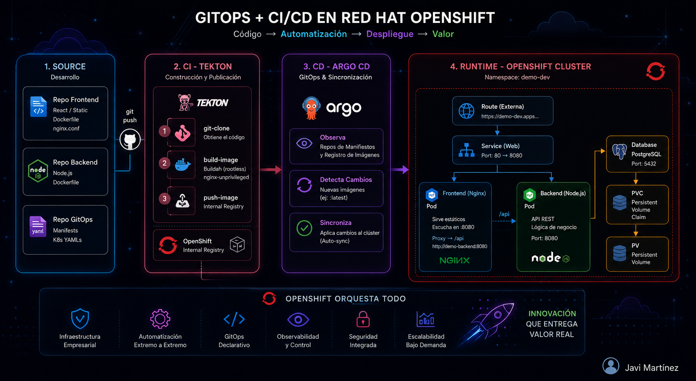
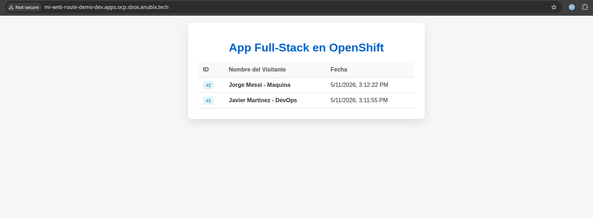
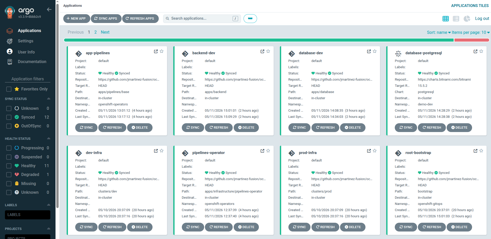

# Enterprise Full-Stack Orchestration: OpenShift + GitOps + CI/CD

Este repositorio documenta la arquitectura, el despliegue y la automatización de una aplicación Full-Stack en un entorno empresarial de **Red Hat OpenShift**. El proyecto demuestra el uso de **GitOps**, seguridad en contenedores y despliegue continuo (CI/CD).

---

## 🏗️ Arquitectura del Sistema

## 🏗️ Arquitectura del Sistema

Para garantizar la seguridad y eficiencia en OpenShift, se implementó una arquitectura de 3 capas con un Reverse Proxy integrado:



*Figura 1: Diagrama de flujo de red y componentes del clúster.*

* **Frontend:** Servidor Nginx (Unprivileged) actuando como Host Estático y Reverse Proxy.
* **Backend:** API REST construida en Node.js.
* **Database:** PostgreSQL con persistencia de datos mediante Persistent Volume Claims (PVC).


---

## 🚀 Flujo de Entrega Continua (CI/CD)

El ciclo de vida del software está totalmente automatizado:

1.  **CI (Tekton):** Al realizar un `git push`, un **Pipeline de Tekton** clona el código, construye la imagen de contenedor utilizando **Buildah** y la publica en el registro interno de OpenShift.
2.  **CD (Argo CD):** Basado en el patrón **GitOps**, Argo CD monitorea el repositorio de manifiestos y sincroniza automáticamente el estado deseado en el clúster.


---

## 🛠️ Retos Técnicos y Soluciones

Durante la implementación, se resolvieron desafíos críticos de infraestructura:

### 1. Hardening de Seguridad (Non-Root Containers)
OpenShift utiliza **Security Context Constraints (SCC)** que prohíben ejecutar contenedores como root.
* **Solución:** Se implementó una imagen de `nginxinc/nginx-unprivileged:alpine-slim` y se ajustaron los permisos de carpetas temporales (`/var/cache/nginx`) mediante instrucciones `RUN chmod -R g+w` en el Dockerfile para cumplir con las políticas de usuario aleatorio de OpenShift.

### 2. Eliminación de CORS mediante Reverse Proxy
Para evitar problemas de seguridad y simplificar la comunicación entre capas:
* **Solución:** Se configuró Nginx como proxy inverso. Todas las peticiones al path `/api` son redirigidas internamente al servicio del Backend en el puerto 8080.
    ```nginx
    location /api {
        proxy_pass http://demo-backend:8080;
        proxy_http_version 1.1;
        proxy_set_header Host $host;
    }
    ```

### 3. Persistencia de Datos
* **Solución:** Uso de **StorageClasses** dinámicas para la base de datos PostgreSQL, asegurando que la información de los visitantes persista ante reinicios de los Pods.

---

## 📊 Evidencia de Implementación

### App Full-Stack Funcionando

*Estado actual: Conectividad exitosa entre capas y persistencia verificada.*

### Estado de Argo CD

*Sincronización automática activa y estado saludable (Healthy).*

---

## 💻 Tecnologías Utilizadas
* **Plataforma:** Red Hat OpenShift
* **Automatización:** Tekton & Argo CD
* **Servidores:** Nginx & Node.js
* **Base de Datos:** PostgreSQL
