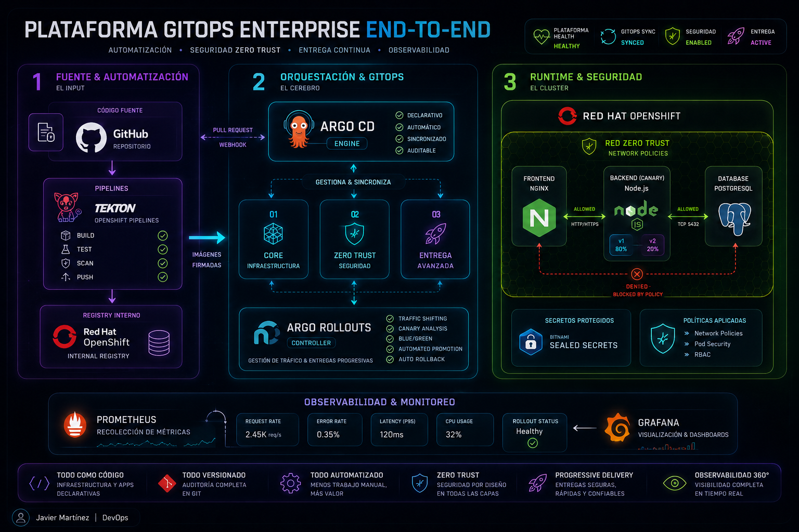

# ENTERPRISE GITOPS PLATFORM ON RED HAT OPENSHIFT

<p align="center">
  Plataforma GitOps enterprise end-to-end construida sobre Red Hat OpenShift.
</p>

<p align="center">
  Automatización • Zero Trust • Progressive Delivery • Observabilidad
</p>

---

## Arquitectura General




---

# Visión General

Este repositorio representa una plataforma GitOps enterprise moderna diseñada sobre Red Hat OpenShift.

El proyecto busca mostrar cómo construir una arquitectura cloud-native completa utilizando:

- GitOps
- CI/CD declarativo
- Seguridad Zero Trust
- Progressive Delivery
- Gestión segura de secretos
- Observabilidad en tiempo real
- Automatización end-to-end

Todo gestionado como código.

---

# Objetivo del Proyecto

La idea de este repositorio no es solamente desplegar aplicaciones.

El objetivo es mostrar la evolución progresiva de una plataforma enterprise real, pasando desde workloads básicos hasta mecanismos avanzados de seguridad y delivery moderno.

Cada directorio representa una etapa incremental de madurez de la plataforma.

---

# Stack Tecnológico

## Plataforma

- Red Hat OpenShift
- Kubernetes
- OpenShift Pipelines (Tekton)

## GitOps & Delivery

- Argo CD
- Argo Rollouts

## Seguridad

- Network Policies
- RBAC
- Bitnami Sealed Secrets

## Observabilidad

- Prometheus
- Grafana

## Aplicación Demo

- Frontend: Nginx
- Backend: Node.js
- Database: PostgreSQL

---

# Estructura General del Proyecto

```bash
.
├── argocd-apps/
├── k8s-manifests/
├── assets/
├── pipelines/
└── README.md
```

---

# Roadmap Evolutivo de la Plataforma

Dentro del directorio `k8s-manifests` se encuentra la evolución progresiva del proyecto.

Cada carpeta representa una etapa distinta de construcción y madurez de la plataforma.

```bash
k8s-manifests/
├── 01-core
├── 02-security
└── 03-advanced-delivery
```

---

# 01-core → Base de la Plataforma

Primera etapa del proyecto.

Acá se construye la base funcional de la aplicación sobre OpenShift.

Incluye:

- Frontend
- Backend
- PostgreSQL
- Deployments básicos
- Service Monitor
- Gestión inicial de secretos

Estructura actual:

```bash
01-core/
├── backend/
├── database/
├── frontend/
└── README.md
```

El objetivo de esta etapa es tener la plataforma funcionando correctamente dentro del cluster.

---

# 02-security → Zero Trust & Aislamiento

Segunda etapa del proyecto.

Acá comienza la implementación de seguridad Zero Trust utilizando Kubernetes Network Policies.

El objetivo deja de ser solamente "que funcione" y pasa a ser:

- controlar tráfico interno,
- aislar workloads,
- limitar comunicación lateral,
- permitir únicamente conexiones explícitas.

Incluye políticas como:

- default deny
- frontend → backend
- backend → database
- monitoring access
- ingress access

Estructura actual:

```bash
02-security/
├── allow-back-to-db.yaml
├── allow-front-to-back.yaml
├── allow-monitoring.yaml
├── allow-openshift-ingress.yaml
├── default-deny.yaml
└── README.md
```

Esta etapa representa la evolución hacia una arquitectura más segura y enterprise-ready.

---

# 03-advanced-delivery → Progressive Delivery

Tercera etapa del proyecto.

Acá se implementan estrategias modernas de despliegue utilizando Argo Rollouts.

Incluye:

- Canary Deployments
- Traffic Shifting
- Progressive Delivery
- Releases controladas
- Estrategias avanzadas de rollout

Estructura actual:

```bash
03-advanced-delivery/
├── backend/
├── frontend/
└── README.md
```

Esta etapa representa la madurez operacional de la plataforma.

---

# README.md por Directorio

Cada etapa del proyecto contiene su propio `README.md`.

La idea es mantener:

- el README raíz como visión general de la plataforma,
- y cada subdirectorio como documentación detallada de implementación.

Dentro de cada carpeta se documenta:

- qué se construyó,
- por qué se implementó,
- cómo funciona,
- decisiones técnicas,
- evolución del proyecto por etapa.

---

# GitOps Bootstrap

Toda la plataforma puede desplegarse automáticamente utilizando Argo CD.

Una vez instalado Argo CD en OpenShift:

```bash
argocd app create -f argocd-apps/root-app.yaml
```

Esto desplegará automáticamente toda la estructura declarativa del proyecto dentro del cluster OpenShift.

---

# ¿Qué hace el Root Application?

El archivo `root-app.yaml` actúa como punto central de sincronización GitOps.

Desde allí:

- Argo CD sincroniza todos los recursos,
- despliega manifests automáticamente,
- mantiene el estado declarativo,
- y administra la plataforma completa desde Git.

---

# Flujo General de la Plataforma

```text
GitHub
   ↓
Tekton Pipelines
   ↓
OpenShift Internal Registry
   ↓
Argo CD
   ↓
OpenShift Cluster
   ↓
Argo Rollouts
   ↓
Canary / Progressive Delivery
   ↓
Observabilidad + Seguridad
```

---

# Características Principales

## GitOps Declarativo

Toda la plataforma es administrada desde Git.

---

## Seguridad Zero Trust

La comunicación entre workloads está controlada mediante Network Policies.

---

## Progressive Delivery

Deployments Canary utilizando Argo Rollouts.

---

## Gestión Segura de Secretos

Protección de credenciales utilizando Bitnami Sealed Secrets.

---

## Observabilidad Integrada

Monitoreo y métricas utilizando Prometheus y Grafana.

---

## Infraestructura Reproducible

Toda la plataforma puede recrearse automáticamente desde manifests declarativos.

---

# Requisitos

- OpenShift Cluster
- Argo CD
- OpenShift Pipelines
- CLI:
  - oc
  - kubectl
  - argocd

---

# Filosofía del Proyecto

Este repositorio fue diseñado con una idea clara:

> construir infraestructura moderna como un ecosistema integrado, observable y automatizado.

No como componentes aislados.

---

# Autor

```text
Javier Martínez | DevOps
```